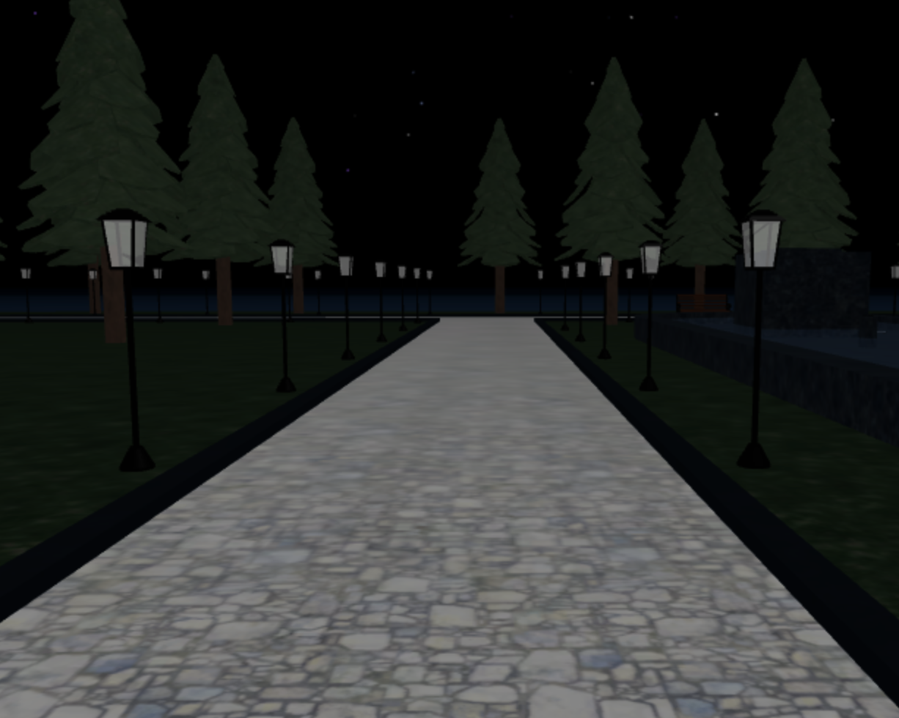

# Powerhouse

## Description

Powerhouse is a building that includes all powerhouse operators to enable or disable outdoor accessories. From inside the powerhouse building, you will see all powerhouse generators at the left side and break room at the right side.

## Scripts

I wrote two scripts to deal with powerhouse generators. 

The first script deals with player's interaction with one of the powerhouse generators while the second script deals with all powerhouse generators.  Each script passes in different parameters and data depending on the power house generator. 

### Example

*Post Lights Enabler script*

This script that deals with the post lights generator, which is one of the powerhouse generators. From lines 19 to 36, it deals with the player's interaction with the generator to enable or disable post lights. 

The **PowerHandler** BindableEvent communicates with the **Powerhouse Operators** script to perform operations. The **MovePowerButton** BindableEvent performs animations for sliding the button, which indicates an enabled or disabled generator.

 

*Powerhouse Operators script*
 

This script includes all powerhouse operators, but from the image shown above only shows an event that handles post lights. It includes three parameters to change the appearance of all bulbs of the post lights, and enable or disable PointLight inside the bulbs.

 

 *Post Lights Generator Disabled*

 *Post Lights Off*

 *Post Lights Generator Enabled*

 *Post Lights On*

## Other Images

 *Three powerhouse generators: Water Fountain Lights, Water Fountain, and Post Lights*

**More coming soon!**