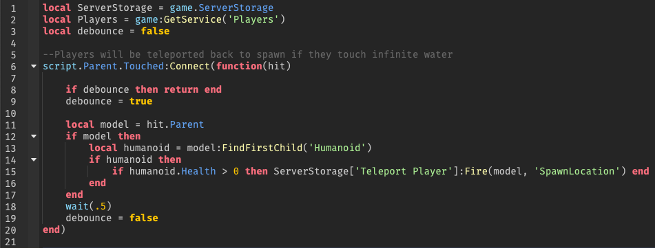
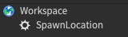
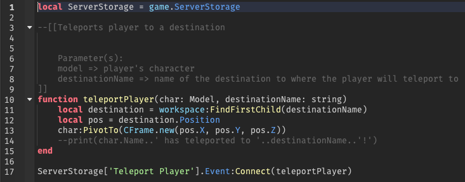

# Teleportation

## Description

Teleportation allows players to different areas of the game. As of this update, it only teleports them back to spawn.

*In the future update, players will be able to teleport to different areas and other Roblox experiences with UI interaction*

## Services

I create and list all methods of teleportation from a script called **Teleport-Services**. 

*In the future, there will be more methods for teleporting players to more places in the game and other experiences.*

### Example

Suppose that the character touches water in my game. I don't want players to be stuck and have them reset their characters. Teleportation provides a quick solution to this!

#### Touching Water

 *Teleport-Player-to-Spawn.lua*

This script will teleport players back to spawn if they touch water. I have to add a debounce and delay the function for half a second to prevent players from lagging themselves. The player also has to be alive for teleportation to work, because it wouldn't really make sense if a dead player gets teleported, right?

The player's character is described as a **Model**, but not all models are characters, which is why we need to check if the water touches only characters. To do this, I added a conditional statement to see if a model contains a **Humanoid** instance *(line 13)*. Humanoids represent models as characters.

 *Player's destination back to spawn*

This script will then communicate with **Teleportation-Services** script to have it teleport players back to **SpawnLocation**, which is where players initially spawn at.

#### Utilizing Teleportation Services

 *Teleportation-Services.lua*

**Teleport Player** BindableEvent gets communications from the script that I discussed earlier to execute a callback function called **teleportPlayer**. It gets the character's model and destination's name to teleport them to that destination. 

Note that **destinationName** references BasePart's name that is parented under **Workspace**.

#### Demo

