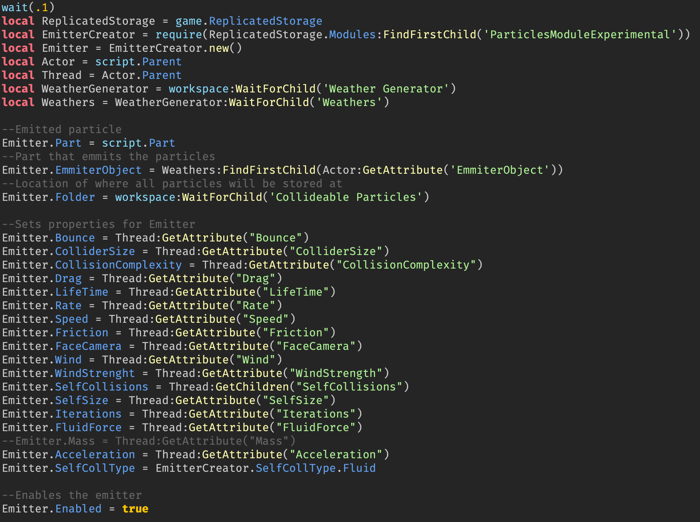

# Weather Generator

## Description

At some point, there is going to be weather during the game especially during the holidays. It snows during December, but other types will be included in the future of the game.

Unfortunately, Roblox Engine's ParticleEmitter makes particles go through BaseParts. Therefore, **ParticlesModuleExperimantal** ModuleScript by BubasGaming is installed to allow particles to collide with other BaseParts. I want to thank this person for creating this module.

## Model

To add weather in the game, I added parts that emit weather and group them into a model called **Weathers**. The reason why I can't create a very huge part is due to extreme lag that builds up during the game. Therefore, I have to duplicate smaller parts to prevent lag.

I parented **Weathers** to a model called **Weather Generator**. This generator is responsible for assigning all weather parts to distinct IDs, which will be later explained.

**Weathers** is transparent. So, you won't see it in the game and is always located above the tallest object in the game.

## Scripts

### Assigning Weather IDs

For this to work, I wrote a script called **Assigned-Weather-IDs**, which loops through all weather parts from **Weathers** model to rename them from <code>Weather</code> to <code>Weather 1...Weather n</code>, where *n* is the total amount of weather parts. This is so that each **Actor** is assigned to unique weather, which will be later explained.   

 *Before the server starts*

I can add as many **Weather** parts as I want to, but it depends on how large the land is right now. Parts are 100x100 studs large and so I move each duplicated parts by 100 studs.   

 *After the server starts*

### Cloning Weather Actors

I followed through BubasGaming's tutorial to create collideable particles for creating the Weather Generator. According to the creator, we have to add the **Actor** instance to generate collideable particles. There are a total of 22 weather parts and therefore, 22 actors are to be cloned and parented under some weather thread.   

 *Snow Actor*

For this example, I want to create a snowy weather for the Christmas season. So I added an Actor instance named **Snow Actor** and parented under **Collideable Particle Actors**, which holds all collidebale particle actors.   

 *Clone Snow Actors LocalScript*

 *Clone-Snow-Actors.lua*

I wrote this script to clone snow actors to **Snow Thread** folder, because the folder contains attributes for the behavior of snow particles, which will be explained later on.

 *Cloned Snow Actors when the client joins the server*

Apparently, I have to run the game as the client since I created a LocalScript *(not Script)*. As you can see the amount of **Snow Actors** is the same as weather parts if you do the counting.

### Generating Collideable Weather Particles

I took my time to play around the developer's experience on generating particles. I noticed that all particles are parented under a folder that has a collection of them that are present in the game. In my game, I named it **Collideable Particles**. 

 *Particles generated when the client joins the game*

I want to keep the name of all particles as generic. Therefore, all of them are named **Part**. These parts despawn overtime based on its **LifeTime** property, which is amount of seconds for these parts to despawn. This property is from **Snow Thread** folder and there are more properties, which will be later explained.

 *Collideable Particle Actors*

 *Generate Collideable Snow Particles LocalScript*

I created another folder inside the ReplicatedStorage called **Collideable Snow Actors**. This folder has a list of actors, or type of particles, that will be rendered and generated inside the game. Recall that the **Snow Actors** for instance is used as a snow generator, which is then cloned into **Snow Thread**. The **Part**, as recalled, is a snow particle, that I modeled and the **Generate Collideable Snow Particles** LocalScript configures properties for generating snow when the player joins the game. 

### Creating Weather Threads

 *Snow Thread Properties*

The final piece is to clone all weather actors to a thread so that they can apply properties to generate snow. For example, I cloned **Snow Actors** inside **Snow Thread** folder so that all of them apply those properties from that folder. 

You can read the developer's **Collideable Particles Module** API documentation for more info about the properties.

## Snow Weather Demo

## Sources

Collideable Particles Module - https://devforum.roblox.com/t/collideable-particles-module-self-collisions-update-v32/2279402/1